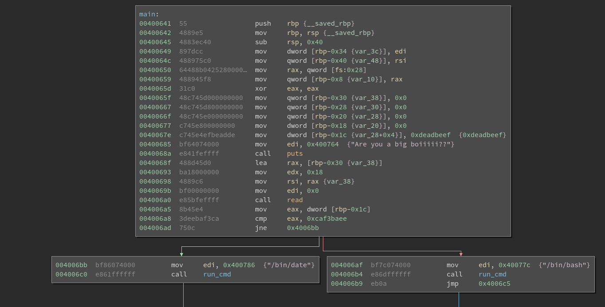
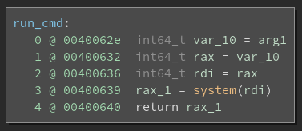

# Pwn 25 - bigboy

### Description

> Only big boi pwners will get this one!  
> `nc pwn.chal.csaw.io 9000`

### Attachments

* [boi](./boi)

### Solution

Opening the included binary in Binja we can see two functions:

This seems like a simple crackme. We obviously want to fail the branch at
`0x4006ad` so that `run_cmd("/bin/bash")`, instead of `run_cmd("/bin/date")`, is
called. At first glance, this may not seem possible. The branch compares `dword
[rbp-0x1c]` to `0xcaf3baee` [sic?], but that variable is set to `0xdeadbeef` and
isn't written to again. However, this function has a buffer overflow vuln:

We have a buffer at `rbp-0x30` which we `read` up to `0x18` characters into.
That means we control the range `[rbp-0x30, rbp-0x30+0x18) = [rbp-0x30,
rbp-0x18)`. The `dword [rbp-0x1c]` covers the range `[rbp-0x1c, rbp-0x18)`,
which is completely contained inside our buffer!

So, we need `(rbp - 0x1c) - (rbp - 0x30) = 0x14 = 20` bytes of padding followed
by little-endian `0xcaf3baee` (i.e. `'\xee\xba\xf3\xca'`).

See [solve.py](solve.py).

### Flag

    flag{Y0u_Arrre_th3_Bi66Est_of_boiiiiis}
