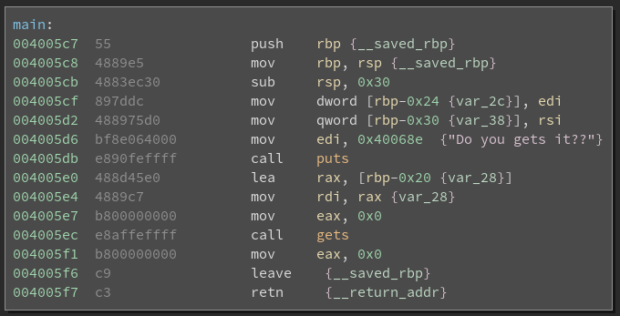
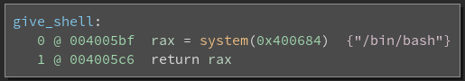

# Pwn 50 - getit

### Description

> Do you get it?  
> `nc pwn.chal.csaw.io 9001`

### Attachments

* [get_it](./get_it)

### Solution

Opening the included binary in Binja we can see two functions:

Much like [bigboy](../bigboy), this is a classic buffer overflow vulnerability.

The buffer that is passed to `gets` is at `rbp-0x20`. The saved instruction
pointer is at `rbp + sizeof(void*)`, and since this is a 64-bit binary, `rbp+8`.
That means we need `(rbp + 8) - (rbp - 0x20) = 0x28 = 40` bytes of padding,
followed by the address of `give_shell`.

Another way of figuring out this offset is by looking at the MLIL variable name
of our buffer. Binja names variables `var_x` by default, where `x` is the
negative offset (in hexadecimal) of that variable from the entry value of the
stack pointer. Since on x86/amd64, the stack pointer points at the return
address upon function entry, this is the exact amount of padding we need if we
want to overwrite the saved return address! Concretely, Binja named our buffer
`var_28`, which means we need `0x28` bytes of padding. Note this is the same
value we derived manually.

See [solve.py](solve.py).

### Flag

    flag{y0u_deF_get_itls}
