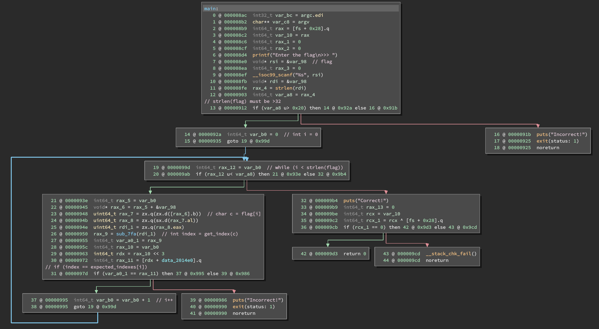
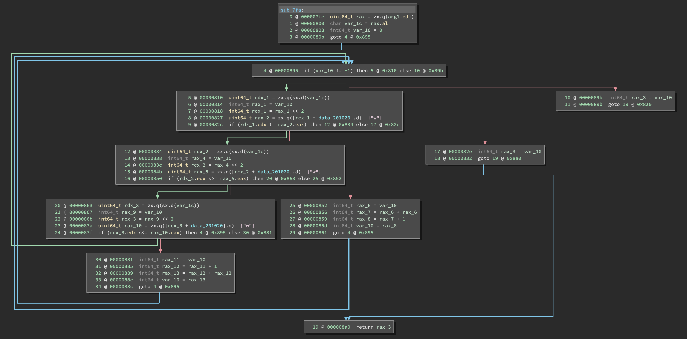
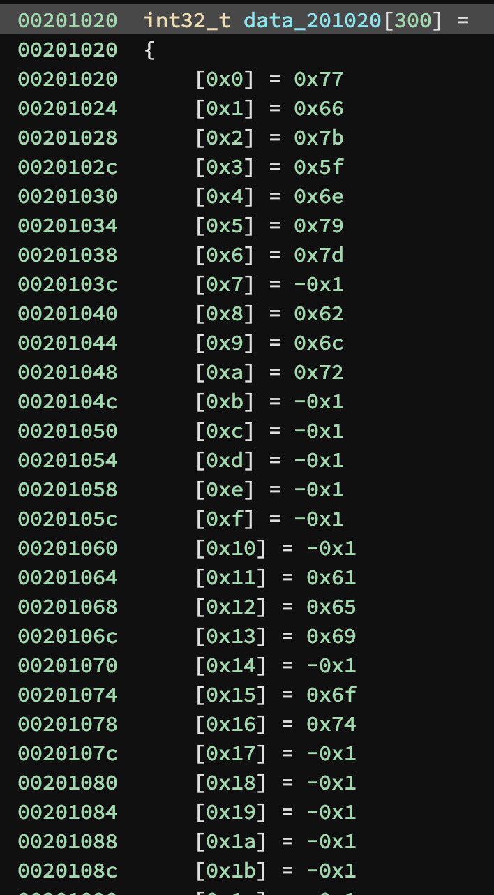

# CSAW CTF Quals 2019

## Reverse

### Beleaf - 50 pts

> tree sounds are best listened to by https://binary.ninja/demo or ghidra

[beleaf](rev/beleaf/beleaf)

Inspecting `main()`, we see the framework for a standard reversing challenge.



Here's a breakdown of what's happening (note that these addresses correspond to
those shown in Binja's MLIL view, so they might not include all instructions
that perform the action specified in the description column; the addresses
listed are for quick reference only):

| address        | description                                                                              | C equivalent                                |
|----------------|------------------------------------------------------------------------------------------|---------------------------------------------|
| `0x8e0..0x8ef` | string (the flag) is read from stdin into `var_98` (which I'll call `flag`)              | `char flag[0x88]; fgets("%s", flag);        |
| `0x8fb..0x903` | the string length of the flag is taken and stored in `var_a8` (which I'll call `len`)    | `size_t len = strlen(flag);`                |
| `0x912`        | check if `len` is greater than 32                                                        | `if (len > 0x20) {`                         |
| `0x92a`        | a counter variable (I'll call it `i`) is initialized to 0                                | `  int i;`                                  |
| `0x99d..0x9ab` | a loop is set up to execute until `i == len`                                             | `  while (i < len) {`                       |
| `0x93e..0x94e` | a single character (`c`) is taken from `flag` at position `i`                            | `    char c = flag[i];`                     |
| `0x950`        | some checker function (`get_index`, we'll see why I name it this later) is called on `c` | `    int index = get_index(c);`             |
| `0x955..0x97d` | the index from `get_index(c)` is compared against some global array                      | `    if (index == expected_indexes[i])`     |
| `0x995`        | `i` is incrememnted and the loop is continued                                            | `      i++;`                                |
| `0x986..990`   | we lose                                                                                  | `    else { puts("Incorrect!"); exit(1); }` |
| `0x9b4`        | we win                                                                                   | `  } puts("Correct!");`                     |
| `0x91b`        | we lose                                                                                  | `} puts("Incorrect!"); exit(1);`            |

Let's examine `sub_7fa` (`get_index`):



I won't go into as much detail about reversing this function, but here's an
approximation in C:

```c
int32_t bst[300];

int32_t get_index(char c) {
    int32_t idx = 0;
    while (idx != -1) {
        if (c == bst[idx])
            break;

        if (c < bst[idx])
            idx = 2*idx + 1;
        else if (c > bst[idx])
            idx = 2*idx + 2;
    }
    return idx;
}
```

On closer examination of `bst` (address `0x201020`), it appears to be a [Binary
Search Tree](https://en.wikipedia.org/wiki/Binary_search_tree) of sorts.
However, this isn't important to solving the challenge. We can simply think of
it as a list that assignes each unique character in the flag a unique index into
the list.



Let's think about what the possible return values of `get_index` can be. There
is only one place that it can return from, so that simplifies things a bit. The
return value of `get_index` will always be `idx`

Now what are the possible values of `idx` at the return statement. The return
statement directly follows the while statement, and there are only two exits
from the while statement: a) failing the condition (`idx != -1` is false), or b)
encountering the `break` statement. If we encounter (a), then `idx` must be `-1`
(`0xffffffff` since it's a `int32_t`), though this is unlikely, since `idx`
would have to grow to very large numbers before hitting `0xffffffff` and we
would likely hit a segfault before it ever gets to be that large.

The most like case is that we've hit the `break` statement, which means that `c
== bst[id]`. This is a very simple constraint. In fact, it allows us to
essentially ignore the rest of the logic of this function. Since the return
value of `get_index(c)` is `idx`, and since we have shoen that it must be true
that `c == bst[idx]`, then it must be true that `get_index(bst[idx]) == idx`.

__Essentially__ what all this means is that `get_index` simply searches for `c`
in `bst` and returns the index at which it found it. We can exploit this simple
property to determine each character of the flag.

In the array `expected_indexes` (address `0x2014e0`), we have the expected
return values of `get_index`. Each value in this array is simply an index into
`bst`, so we can reconstruct the flag quite easily.

```
1) get_index(bst[i]) == i (this is the characteristic property of get_index)
2) get_index(bst[expected_indexes[i]]) == expected_indexes[i] (by replacing i with expected_indexes[i])
3) get_index(flag[i]) == expected_indexes[i] (by analysis of main())
4) get_index(flag[i]) == get_index(bst[expected_indexes[i]]) (by 1 and 2)
5) flag[i] == bst[expected_indexes[i]] (by 4)
```

Once we've learned this, the actual solution is quite simple. See [sol.py](rev/beleaf/sol.py)
