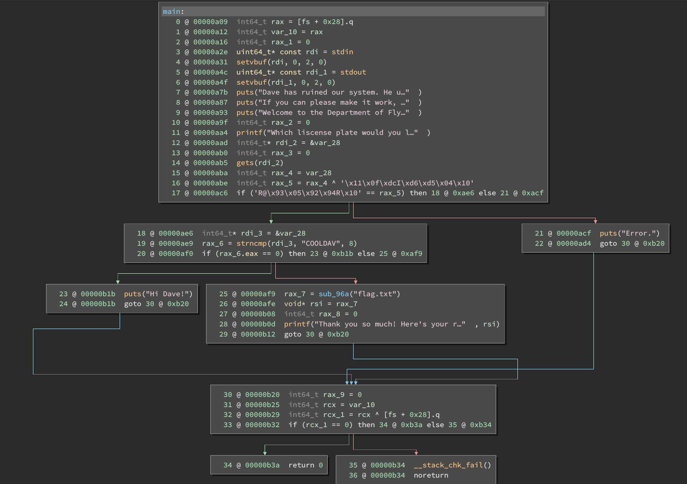
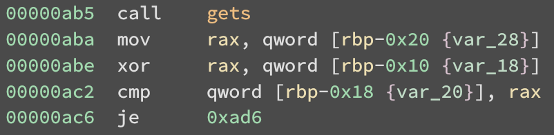

# B01lers CTF 2020

After a long hiatus playing any CTFs, I had a lot of fun getting back into the
swing of things by playing b01lers CTF, put on by Purdue University.
Unfortunately, I only had the time to look at three of the easier pwning
challenges, and solve two of those.

## Pwn 100 - Department of Flying Vehicles

> Dave ruined the code for the DFV starship registry system. Please help fix it.
>
> `nc pwn.ctf.b01lers.com 1001`  
> [dfv](dfv/dfv)  
> Author: nsnc

This is appears to be a simple keygen/reversing challenge:

```
$ ./dfv
Dave has ruined our system. He updated the code, and now he even has trouble checking his own liscense!
If you can please make it work, we'll reward you!

Welcome to the Department of Flying Vehicles.
Which liscense plate would you like to examine?
 > EATDUST
Error.
```

But when we disassemble it:



At address `0xabe`, we see that our string is XORed with
`'\x11\x0f\xdcI\xd6\xd5\x04\x10'` (let's call this value `xor`) and then at
address `0xac2` the first 8 bytes are compared to `'R@\x93\x05\x92\x94R\x10'`
(let's call this value `key`). Equivalently, our input is compared to `xor ^
key`, which equals `COOLDAV\0`. If our string matches this value, then
execution continues to a branch were it is possible to reach `sub_96a`, which
prints `flag.txt`. If, on the other hand, our string does not match at all, then
the program exits without printing the flag.

So we know that our input string must be `"COOLDAV"` if we want to print the
flag. Is that all there is to this challenge? A simple XORed string? No! This is
a _100_ point challenge. It better take more than 5 minutes to solve!

If we examine the block starting at `0xad6`, we will see that our same input is
`strncmp`'d with `"COOLDAV"`, and then `sub_96a` is called if our string __does
not match__ with `"COOLDAV"`. So, what can we deduce? We know that our string
must _not_ match `"COOLDAV"`, but _must_ match `"COOLDAV"`. These two
constraints are logical inverses of each other, so requiring both would be
unsatisfiable. In short, the challenge is unsolvable. The end. Thanks for a
wonderful CTF Purdue!

Wait, let's look closer at that `xor` at `0xabe`. Looking at the disassembly, we
can see that `xor` and `key` both live in memory (indeed, there is no version
of the [`xor` instruction on AMD64](https://www.felixcloutier.com/x86/xor) that
can encode a 64-bit immediate operand). In fact, they both live on the stack.
Hmm, if only there were a way to overwrite those two values...



Oh, now what's that? A call to `gets`? The
[dangerous](https://stackoverflow.com/q/1694036/1529586),
[unsafe](https://cwe.mitre.org/data/definitions/242.html), and
[deprecated](https://github.com/bminor/glibc/blob/e4a399921390509418826e8e8995d2441f29e243/libio/stdio.h#L571-L582)
`gets`?! Well, now that we know we have a buffer overflow on the stack, we
should be able to overwrite `xor` or `key`, or both! This will allow us to give
an input string that does not match `"COOLDAV"`, and by changing `xor` and
`key`, it can match `xor ^ key`. So we need to choose an `s`, `xor`, and `key`,
such that `s ^ xor == key` and `s != "COOLDAV"`. Solving the challenge is as
simple as sending each in order. See [sol.py](dfv/sol.py) for the full solution.
